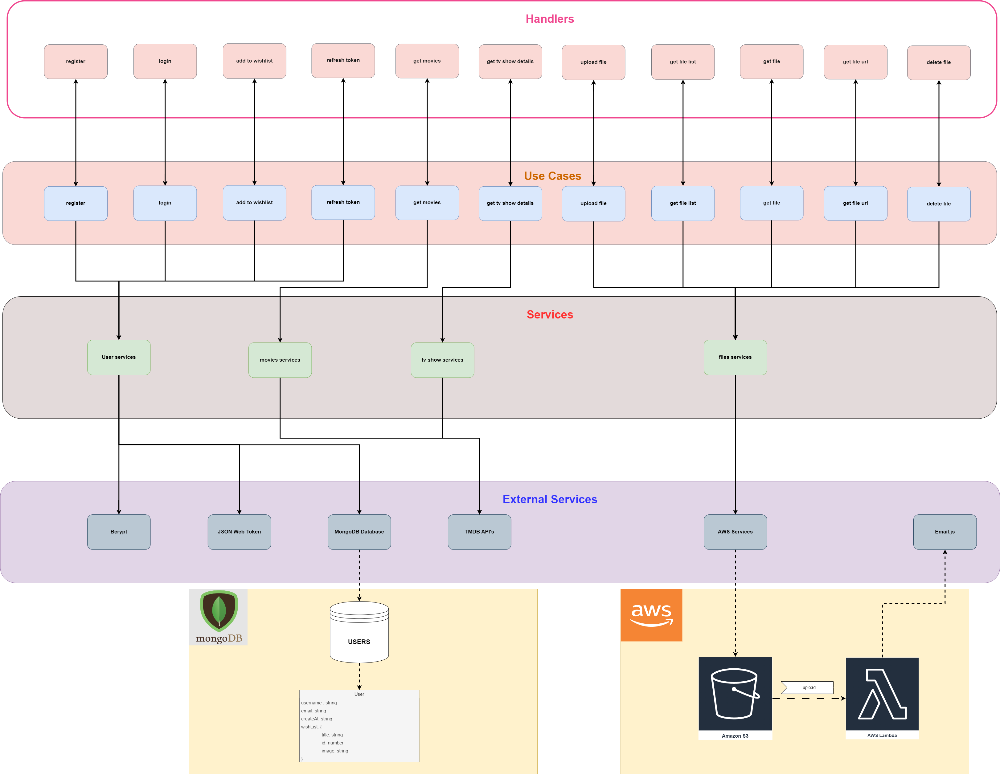
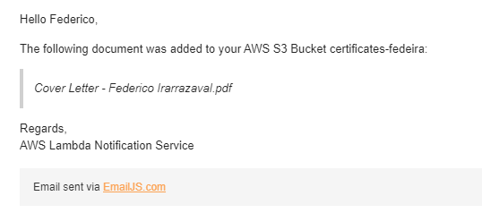

# Movie & TV Show API

This project is a backend application HTTP REST API.

The API provides endpoints to:

- Fetch movies,
- Fetch TV show details,
- Register users,
- Login users,
- Refresh JWT access token,
- Add movies or TV shows to a user's wishlist,
- Upload file to AWS S3 bucket and notify by email,
- Get files list from AWS S3 bucket,
- Get file url from AWS S3 bucket,
- Get file from AWS S3 bucket,
- Delete file in AWS S3 bucket, and
- Create a document record in DynamoDB for an uploaded file.

The project follows clean architecture principles to ensure a well-organized and maintainable codebase.

## Table of Contents

- [Project Structure](#project-structure)
- [Architecture](#architecture)
- [Tech Stack](#tech-stack)
- [Installation](#installation)
- [Environment Variables](#environment-variables)
- [Running the Project](#running-the-project)
- [Testing](#testing)
- [API Endpoints](#api-endpoints)
- [Error Handling](#error-handling)
- [License](#license)

## Project Structure

Below is the organized structure of folders and files in the project (all under `backend/`):

```
backend
├── lambda
│    └── notify-on-upload
│          ├── index.js
│          └── package.json
├── packages
│    ├── clients
│    │   ├── awsClient
│    │   ├── tmdbClient
│    │   └── dataBaseClient
│    ├── env
│    │   └── config.ts
│    ├── errors
│    │   └── ...
│    └── fastify
├── server
│   ├── handlers
│   │   └── ...
│   ├── errors.ts
│   └── main.ts
├── src
│   ├── models
│   │   └── ...
│   ├── services
│   │   ├── files
│   │   ├── movies
│   │   ├── tvShows
│   │   └── users
│   └── useCases
│       ├── database
│       ├── files
│       ├── movies
│       ├── tvShows
│       └── users
├── test
│   └── ...
├── package.json
├── package-lock.json
├── Dockerfile
├── tsconfig.json
└── .env
```

## Architecture

This project follows the principles of Clean Architecture to ensure that the system is easy to understand, maintain, and extend.

The project is divided into three main layers:

1. **Handlers or Delivery Layer**: This layer contains the HTTP handlers that receive incoming HTTP requests, call the appropriate use case, and return the HTTP response. The handlers are responsible for parsing the request, validating the input, and returning the response.

```json
├── server
│   ├── handlers
│   |   ├── addToWishlistHandler.ts
│   │   └── ...
│   ├── errors.ts
│   └── main.ts
```

2. **Use Cases or Application Layer**: This layer contains the use cases that represent the application's business rules. Each use case is a class that implements a specific feature of the application. The use cases are independent of the delivery mechanism (HTTP, CLI, etc.) and the data access layer (database, external services, etc.). Use cases interact with the services to perform specific tasks, ensuring that the business rules are enforced.

```json
│   └── useCases
│       ├── database
│       ├── files
│       ├── movies
│       ├── tvShows
│       └── users
```

3. **Services or Data Access Layer**: This layer contains the services that interact with external data sources such as databases (i.e: mongoDB, DynamoDB), external APIs (i.e: TMBD APIs), etc. The services in this layer are responsible for fetching and storing data from and to external sources.

```json
│   ├── services
│   │   ├── files
│   │   ├── movies
│   │   ├── tvShows
│   │   └── users
```

4. **Models**: This layer contains the models that represent the core business objects of the application. Models are independent of the data access layer objects (entities).

```json
│   ├── models
│   │   └── ...
```

5. **Lambda folder**: The lambda folder contains the code for the AWS Lambda function that is triggered when a file is uploaded to the S3 bucket. The lambda function sends an email notification when a new file is uploaded. Please note that the lambda function is not part of the main application and is only used to demonstrate the integration with AWS services. The lambda function is deployed separately from the main application. The lambda function is triggered by an S3 event and sends an email notification using the AWS SES service. The lambda function is written in Node.js and uses email.js library to send emails.

```json
├── lambda
│    └── notify-on-upload
│          ├── index.js
│          └── package.json
```

**Example of flow:**

Here is a brief overview of how a request flows through the system:

1. Handler: The client sends an HTTP request to the server, which is received by a handler. Handlers are responsible for parsing the request using a schema (e.g., Zod), mapping the input data to the correct format if required and calling the appropriate use case.
2. Use Case: The use case is responsible for enforcing the business rules and orchestrating the flow of data between the services if required.
3. Service: If interaction with a a service is required by use case, services are required to perform its tasks (e.g., fetching data from a database, calling an external API, etc.) and return the result to the use case.
4. Response: The use case returns the result to the handler, which then sends the response back to the client.

The main objective of this architecture is to keep the business rules isolated from the delivery mechanism and the data access layer, making the system more flexible, testable, and maintainable by following the SOLID principles:

- **Separation of concerns**: Each layer has a specific responsibility and is isolated from the other layers.
- **Dependency Rule**: Inner layers should not depend on outer layers. The flow of dependencies is always inward. For example, the business logic layer or use cases does not know anything about the delivery layer or the data access layer (services).
- **Encapsulation**: Each layer hides its implementation details from other layers.
- **Interface Adapters**: The use of interfaces allows the system to be easily adapted to different frameworks or libraries.

Below, an image of clean architecture is shown:


Please note flow of data. Handler ("Controller") receives the request, then it calls the use case, which may or may not interact with services (DB, External Interfaces, etc.). The use case returns the response to the controller ("Presenter"), which sends the response back to the client.

Entities (in our development "Models") are the objects that represent the core business objects of the application. They are independent of the data access layer object (in our development "Entities").

Below, an image the architecture of the project is shown:



## Tech Stack

- **Node.js**: JavaScript runtime built on Chrome's V8 JavaScript engine.
- **TypeScript**: A superset of JavaScript that adds static types to the language.
- **Javascript**: A high-level, interpreted programming language that conforms to the ECMAScript specification. In this project is used only for the lambda function.
- **Fastify**: A fast and low overhead web framework for Node.js.
- **Zod**: A TypeScript-first schema declaration and validation library, used to validate request payloads and environment variables.
- **JWT**: JSON Web Tokens are an open, industry-standard RFC 7519 method for representing claims securely between two parties.
- **bcrypt**: A library for hashing user passwords before storing them.
- **MongoDB / Mongoose**: MongoDB is a NoSQL database that stores data in flexible, JSON-like documents. For this project I'm using MongoDB Atlas, a fully managed cloud database service, accessed through Mongoose as the ODM.
- **Docker**: A platform for developing, shipping, and running applications in containers.
- **TMDB API**: The Movie Database (TMDb) API is a resource for any developers that want to integrate movie, TV show, and cast data in their application.
- **AWS S3**: Amazon Simple Storage Service (Amazon S3) is an object storage service that offers industry-leading scalability, data availability, security, and performance.
- **AWS DynamoDB**: A fully managed NoSQL database used here to keep a document record for each file uploaded to S3.
- **AWS Lambda**: AWS Lambda lets you run code without provisioning or managing servers.
- **Email.js**: A Node.js module for sending emails using SMTP.
- **Vitest / Supertest**: Used for unit and HTTP-level tests. See [Testing](#testing).

## Installation

1. Clone the repository:

   ```bash
   git clone https://github.com/FedeIra/Project-Backend-Movie.git
   cd Project-Backend-Movie/backend
   ```

2. You can use branches `main` or `develop`.

## Environment Variables

Create a `.env` file in the `backend` directory and add the following environment variables. You can check for such purpose the `.env.example` file in that same directory:

```bash
PORT=3001
HOST=0.0.0.0

TMDB_API_KEY=tmdb-api-key
TMDB_BASE_URL=https://api.themoviedb.org/3

CONNECTION_STRING_DB=mongodb_connection_string
DB_NAME=Movie-Challenge
USER_COLLECTION_NAME=Users

JWT_SECRET=secret-key

AWS_ACCESS_KEY=aws-access-key-id
AWS_SECRET_KEY=aws-secret-access-key
AWS_REGION=aws-region
AWS_BUCKET_NAME=aws-bucket-name
AWS_DYNAME_TABLE_NAME=aws-dynamodb-table-name
```

## Running the Project

### Using Docker:

1. Create a `.env` as described previously.

2. Check Docker is installed and running on your machine.

3. Build and run the container in the `backend` directory with the following commands:

```bash
docker build -t movie-tvshow-api .
docker run -p 3001:3001 --env-file .env movie-tvshow-api
```

### Without Docker:

1. Create a `.env` as described previously.

2. Run either of following commands to start the server:

```bash
npm start
npm run dev
```

## Testing

Tests are written with [Vitest](https://vitest.dev/) and [Supertest](https://github.com/ladjs/supertest), and live in `backend/test`. They cover the main use cases (movies, TV shows, users) and their HTTP handlers, including a regression test that asserts internal error details (like stack traces) are never sent to the client outside of development - see [Error Handling](#error-handling).

From the `backend` directory:

```bash
npm test          # run the suite once
npm run test:watch # re-run on file changes
```

## API Endpoints

The full request/response detail (bodies, headers, examples) for every endpoint lives in the Postman collection at
[`backend/assetsDocumentation/Challenge Movies.postman_collection.json`](backend/assetsDocumentation/Challenge%20Movies.postman_collection.json) —
import it into Postman to try the API directly. The table below is a quick reference of what's available.

| Method | URL | Auth | Description |
| --- | --- | --- | --- |
| POST | `/movies` | No | Fetch movies, with optional filters (genre, recommended, year) and sorts (by date, by average rating). |
| POST | `/tvshow-details` | Yes | Fetch details (seasons, director, etc.) for a given TV show. |
| POST | `/register-user` | No | Register a new user. |
| POST | `/login-user` | No | Log in and receive a JWT access token. |
| POST | `/refresh-token` | Yes | Exchange a current token for a new one. |
| POST | `/add-to-wishlist` | Yes | Add a movie or TV show to the user's wishlist. |
| POST | `/file/:keyName` | Yes | Upload a file to the AWS S3 bucket (form-data). Triggers an email notification via an S3-triggered Lambda. |
| GET | `/files-list` | Yes | List files stored in the AWS S3 bucket. |
| GET | `/fileUrl/:fileKey` | Yes | Get the URL of a file in the AWS S3 bucket. |
| GET | `/file/:fileKey` | Yes | Download a file from the AWS S3 bucket. |
| DELETE | `/file/:fileKey` | Yes | Delete a file from the AWS S3 bucket. |
| POST | `/create-document/:fileKey` | Yes | Create a DynamoDB record for a previously uploaded file, using its S3 metadata. |

Note: `/movies` doesn't require authentication — as in most streaming apps, browsing is open, but adding to a wishlist or viewing more details requires being logged in.

Example of the upload email notification:



## Error Handling

Errors are handled using custom error classes to provide structured error responses. The following error classes are defined:

- CustomError: Base class for all custom errors.
- ClientError: Represents client-side errors (status code 400).
- ServerError: Represents server-side errors (status code 500).
- UnauthorizedError: Represents authentication errors (status code 401).

Errors are caught in the Fastify error handler (`server/errors.ts`) and sent as a response to the client. Internal details (the error message and stack trace, or any `CustomError` details) are only included in the response when `NODE_ENV !== 'production'` - in production the client only ever sees the generic error and status code, never internal details.

```json
├── server
│   ├── handlers
│   │   └── ...
│   ├── errors.ts
│   └── main.ts

```

Some examples of error responses:

```json
{
  "errorCode": 400,
  "error": "Bad request.",
  "validationErrors": [
    {
      "path": "username",
      "message": "Expected string, received number"
    }
  ]
}
```

Outside of production (`NODE_ENV !== 'production'`), unexpected errors additionally include debugging details:

```json
{
  "errorCode": 500,
  "error": "Internal server error.",
  "errorDetails": {
    "message": "Email already in use."
  }
}
```

In production, the same error is returned without `errorDetails`:

```json
{
  "errorCode": 500,
  "error": "Internal server error."
}
```

## License

This project is licensed under the MIT License. See the [LICENSE](LICENSE) file for details.

## Author

Federico Irarrazaval

- LinkedIn: https://www.linkedin.com/in/federicoirarrazaval/?locale=en_US
- Email: fedeirar@gmail.com
- Portfolio: https://portfolio-fedeira.vercel.app/
- GitHub: https://github.com/FedeIra
